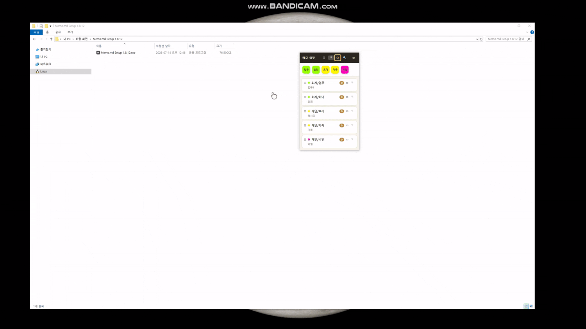
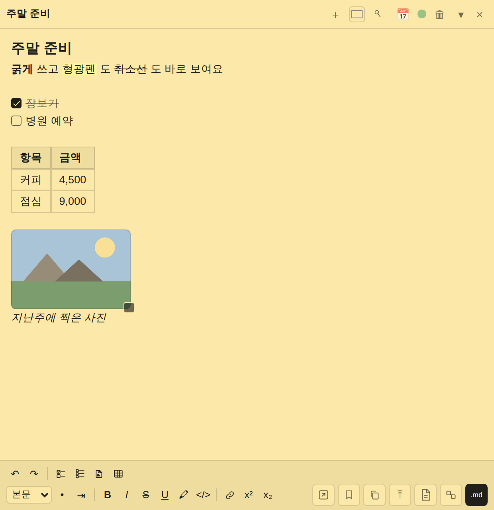
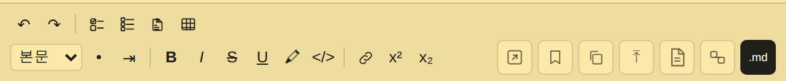
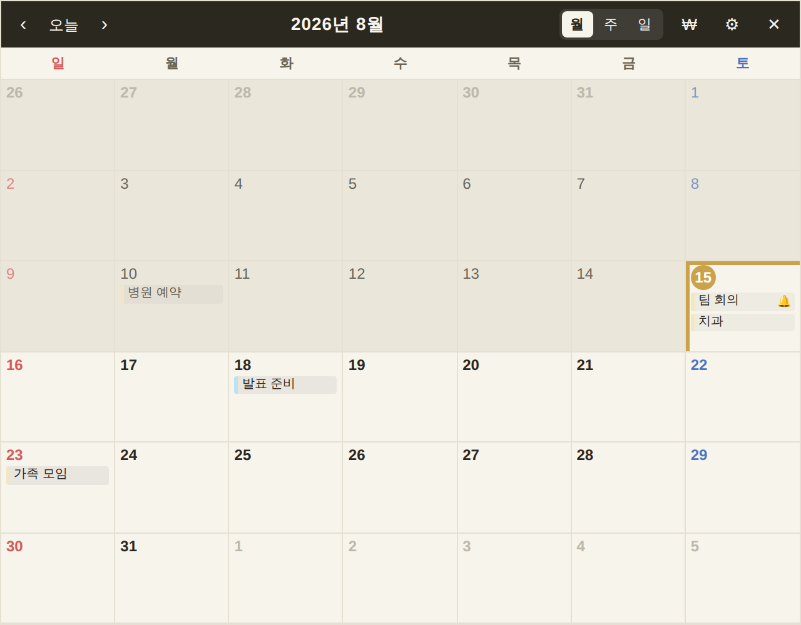

# Memo.md (NEMO)

바탕화면 메모 위젯 + 옵시디언(MD) 내보내기. 현재 버전: 0.20.1

> **0.x = 아직 정식 배포 전이라는 뜻입니다.** 다 만들어서 정식으로 내놓을 때 1.0.0이 됩니다.
> (2026-08-14에 1.x → 0.x로 정리했습니다. 뒷 숫자는 그대로라 "17버전" 같은 감각은 안 깨집니다)





## 이 앱을 만든 이유

바탕화면에 쓰는 메모는 아무렇게나 흩어지기 쉬워서, 나중에 찾거나 서로 연결하기가 어렵습니다. 처음부터 주제별로 나눠서 쓰면 나중에 기억하고 연결하기가 훨씬 쉬워지지 않을까 생각했습니다.

옵시디언(Obsidian)을 써보고 싶었지만 마크다운 문법이 낯설어서 시작부터 막막했습니다. 다시 들여다보니 카테고리 분류와 메모 연결만 잘 되면 마크다운을 몰라도 문제없겠다 싶어서, 혼자 쓰려고 이 앱을 만들었습니다.

"메모 하나 쓰는데 무슨 주제를 정해" 라고 할 수도 있지만, 사실 처음 딱 한 번만 카테고리/주제를 설정해두면 그다음부터는 다른 메모앱과 다를 게 없습니다. 일단 아무렇게나 쓰고 나중에 다른 주제로 옮길 수도 있고요. 위젯의 주제 버튼 한 번 클릭하거나 단축키만 누르면 바로 새 메모가 열립니다. 목표는 작은 메모 하나도 놓치지 않고 저장하면서, 동시에 나중에 옵시디언의 카테고리 구조에 맞게 정리돼 있는 것이었습니다.

마크다운을 잘 모르는 저 같은 사람도 옵시디언의 분류 체계에 맞게 편하게 메모를 쌓을 수 있게 하는 게 이 앱의 목적입니다.

*이 앱은 코딩을 모르는 비개발자가 Claude(AI)의 도움을 받아 만든 것이라, 부족하거나 어설픈 부분이 있을 수 있습니다.*

## 1. 실행 준비 (최초 1회만)

1. Node.js 설치 (없다면): https://nodejs.org 에서 LTS 버전 설치
2. 이 폴더에서 터미널(명령 프롬프트) 열기
3. 아래 명령어 입력 후 엔터 (필요한 부품 설치, 몇 분 걸림)
   ```
   npm install
   ```

## 2. 테스트 실행

```
npm start
```
- 실행하면 위젯이 뜨고, 트레이(우측 하단 시계 옆)에 아이콘이 생깁니다.
- 트레이 아이콘: 클릭 = 위젯 열기/앞으로, 더블클릭 = 새 메모, 우클릭 = 메뉴(설정/도움말/달력/종료)

## 3. 진짜 실행파일(.exe)로 만들기

테스트해보고 마음에 들면, **실행 중인 앱을 먼저 종료한 뒤** 아래 명령으로 설치 파일을 만듭니다.

```
npm run build-win
```
- 완료되면 `dist` 폴더 안에 설치 파일(.exe)이 생성됩니다.
- 기존 버전 위에 그대로 덮어 설치해도 됩니다 — 메모/설정 데이터는 별도 위치(AppData)에 있어서 유지됩니다.

## 4. 처음 사용할 때 꼭 할 것

1. 설정 > 주제관리에서 **주제 먼저 등록** (주제가 있어야 메모를 만들 수 있어요)
2. MD(마크다운) 기능을 쓸 거면 설정 > MD설정에서 **Vault(저장) 폴더 지정**, 안 쓸 거면 MD기능 체크 해제
3. 위젯의 주제 버튼을 눌러 메모 생성 테스트

## 5. 주요 기능 (자세한 건 앱 안의 도움말 참고)

### 메모 쓰기

- **쓰는 즉시 서식이 보입니다.** 굵게·기울임·취소선·밑줄·형광펜·코드·제목·인용·링크를 워드처럼 쓰면 화면에서 바로 그렇게 보입니다. 저장은 여전히 마크다운 원문이라 옵시디언 연동은 그대로입니다. (`Ctrl+B` / `Ctrl+I` / `Ctrl+U`)
- **형광펜은 여섯 색** 중에 고를 수 있습니다.
- **체크리스트가 본문 안에 있습니다.** 본문의 `- [ ] 할일` 줄이 곧 항목이고, 눌러서 체크하면 흐려지면서 취소선이 그어집니다.
- **표도 본문 안에 들어갑니다.** 격자에서 크기를 고르거나, 엑셀·워드에서 복사한 표를 그냥 붙여넣으면 됩니다. 탭으로 칸 이동, 표 주변 버튼으로 줄·칸 추가/삭제, "표 복사"로 엑셀에 표 모양 그대로 붙여넣기.
- **이미지도 본문의 한 줄입니다.** 붙여넣기·드래그·첨부 버튼으로 넣고, 오른쪽 아래 손잡이로 크기를 바꿉니다(원본 비율 유지). 그림을 누르면 **선·화살표·번호**를 그려 넣을 수 있습니다.
- **자동 저장**: 입력 후 0.5초 뒤 자동 저장. 저장 파일은 안전장치(임시파일 교체 + 직전본 백업 + 자동복구)로 보호됩니다.
- **되돌리기**: `Ctrl+Z` 로 120단계까지. 서식·표 조작·체크 표시까지 전부 되돌아갑니다.



### 위젯

- 주제 버튼으로 새 메모, 목록에서 메모 열기/닫기, ⠿ 손잡이 드래그로 주제 순서 변경, 타이틀바 더블클릭으로 접기.
- **눈(👁) 버튼**: 누를 때마다 "다 숨김 → 직전 상태로 → 다 보임 → 직전 상태로" 순환. 숨김 상태는 재부팅해도 기억됩니다.
- **🔍 검색**: 모든 메모의 제목+본문을 검색, 누르면 그 메모가 열립니다.
- **주제 숨김**: 남에게 보이기 싫은 주제는 숨길 수 있고, 위젯 옆 얇은 막대로 다시 꺼냅니다.

### 달력 (0.20.0~)



- 트레이 우클릭 → 달력 열기. 바탕화면에 두고 보는 달력이라 **평소엔 잠겨 있고, 더블클릭하면 쓸 수 있게** 됩니다.
- 월·주·일 보기, 음력, 공휴일(공공데이터포털 특일정보 인증키 필요).
- **지난 날 / 오늘 / 다가올 날**이 한눈에 구분됩니다.
- **날짜를 누르고 [시각][제목] 치고 엔터**면 일정 하나 끝. 메모창이 안 뜹니다. 시각은 비워도 되고 `9`, `930` 처럼 대충 쳐도 알아서 맞춰집니다.
- **목록의 시각을 누르면 그 자리에서 시각만 고칠 수 있습니다.**
- 일정 날짜를 정한 메모는 달력에 자동으로 나타나고, 알람(미리 알림·반복·알림/소리/메모창)을 걸 수 있습니다.

### 가계부

- 달력 위쪽 **₩** 버튼을 누르면 같은 달력이 가계부가 됩니다.
- 날짜를 눌러 분류·금액·메모로 지출을 기록하고, 주간 합계와 이번 달 총액·예산 대비 비율을 봅니다.
- **📊 통계**: 최근 6개월 추이, 분류별 비율, 지난 기간 대비.
- 월급날·주간/월간 예산·고정 지출·분류 관리, 엑셀(CSV) 내보내기.

### 정리와 내보내기

- **MD내보내기**: 메모창 하단 버튼으로 Vault 폴더에 .md 저장(첨부는 "첨부" 폴더로 자동 복사). 두 번째부터는 같은 파일에 덮어씁니다. 내보낸 후 유지/자동삭제는 메모별로 지정 가능.
- **메모 연결**: 이미 내보낸 다른 메모로 가는 `[[링크]]`를 겁니다.
- **템플릿**: 메모의 본문+이미지+창 크기를 주제 템플릿으로 저장, 새 메모에 자동 적용.
- **휴지통**: 지운 메모는 설정 > 휴지통에 60일 보관(첨부 포함), 복구/완전삭제/비우기 가능.
- **백업**: 설정 > 일반에서 전체 내보내기(수동)와 자동 백업(주기 지정). 백업 폴더에서 복구도 가능.
- **저장공간 정리**: 어느 메모에서도 안 쓰는 첨부파일만 찾아 삭제.

### 그 밖에

- **전역 단축키**: 기본 Ctrl+Alt+N으로 어디서든 새 메모 (설정에서 변경/해제 가능).
- **편집바 특수문자**: 자주 쓰는 문자를 등록해 버튼으로 씁니다.
- 메모별 색상·항상 위·접기, 화면 투명도, 앱 글씨체, 이중 실행 방지.
- **MD 기능을 끄면** 서식 도구·표·메모 연결·MD내보내기가 전부 숨겨지고 순수한 메모장이 됩니다.

## 변경 기록

버전별로 무엇이 바뀌었는지는 앱 안의 도움말과 개발 노트에 정리돼 있습니다. 최근 큰 변화는 이렇습니다.

| 버전 | 무엇이 바뀌었나 |
|---|---|
| 0.20.1 | 달력에서 시각만 바로 고치기, 도움말 전면 개편(그림 17장) |
| 0.20.0 | 달력에서 일정 바로 적기, 지난 날/오늘/다가올 날 구분 |
| 0.19.2 | 이미지가 본문 안으로 (위지윅 전환 완료) |
| 0.19.1 | 표가 본문 안으로 |
| 0.19.0 | 체크리스트가 본문 안으로 |
| 0.18.0 | 쓰는 즉시 서식이 보이게 (위지윅 1단계) |

## 라이선스

개인 프로젝트로 제작되었습니다.
